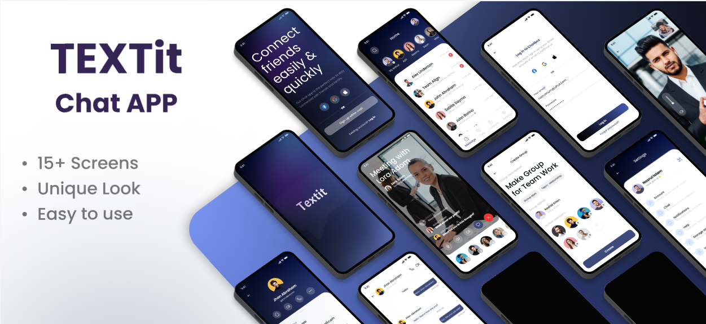

<h1 align="center">Realtime Chat App</h1>

**(React Native, Typescript, Firebase, Redux Toolkit)** 

## Project Overview

The Realtime Chat App is a platform that allows users to manage chats and profile. With usage of firebase this is excellet project with multiple screens. 

This project is part of the [**TechloSet Bootcamps**](https://github.com/techlosetbootcamp) under the Coding Bootcamp 7.0 list.

## Tech Stack

This is the template of 'Realtime Chat App', all data used is from use of **firebase**, and **react-native** is used for app development along with **Typescript** and states are managed by **redux toolkit**.

## Features

- **Home Page**: Displays featured chats and includes a search bar for finding chats along with othe options.
- **Contact Page**: Displays contacts in well designed format along with search bar.
- **Settings**: Shows several options to manage your account along with other management options.

## Project Structure

- **TypeScript**: Ensure type safety by avoiding `any` or `unknown` types.
- **Naming Conventions**: Follow consistent naming conventions for variables, functions, and components.
- **File Organization**: Organize files into designated folders for components, styles, and utilities.

## License

This project is licensed under the **MIT License**.

[comment]: <> (Ending section)

  
  
    <em><b>I genuinely enjoy connecting with new people</b>, so if you'd like to say <b>hi, I'd be delighted to get to know you better!</b> </em>
    <a href="https://linkedin.com/in/arslan-ahmad-dev">Let's talk</a>🙃
  

